# MEDPRO - Medical appointment booking app

- Apps created with React Native
- This is a frontend application, inspired by a medical appointment booking app available on CHPlay. 

MEDPRO is an application that helps users book appointments with doctors and healthcare facilities easily and conveniently. With MEDPRO, you can:

- Book appointments online: MEDPRO allows you to book appointments with doctors or healthcare facilities without having to call or visit in person.
- Manage appointments: You can view and manage all your appointments in one convenient place.
- Appointment reminders: MEDPRO will send reminders via text message or email to ensure you don't miss any appointments.
- Search for doctors and healthcare facilities: You can search for doctors or healthcare facilities by specialty, location, and other criteria.

- This is a React Native web frontend application, using Firebase as the backend for authentication and app data storage.

  Some images of the application when it's completed :
  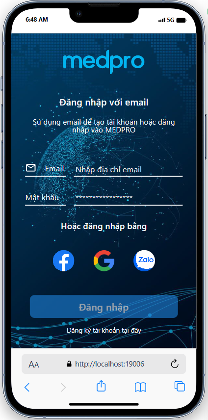
  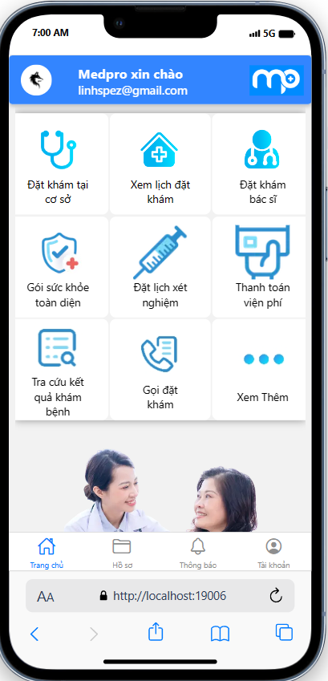
  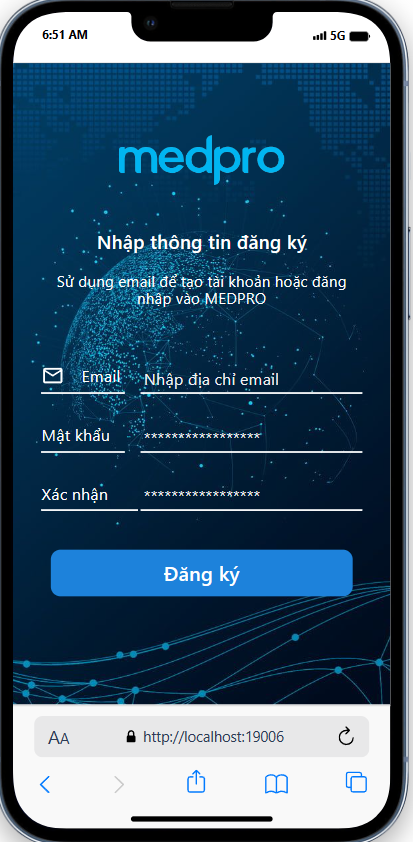
  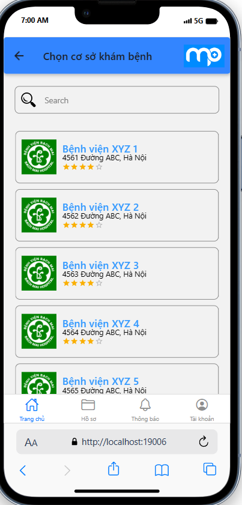
  
  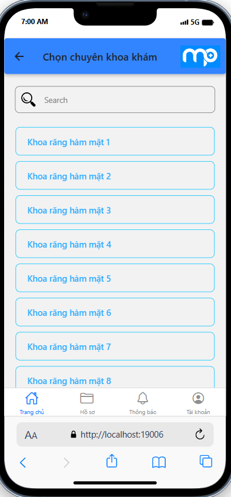
  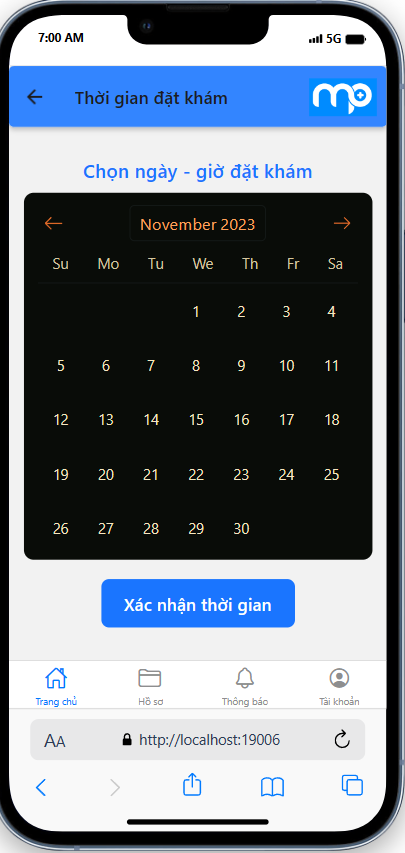
  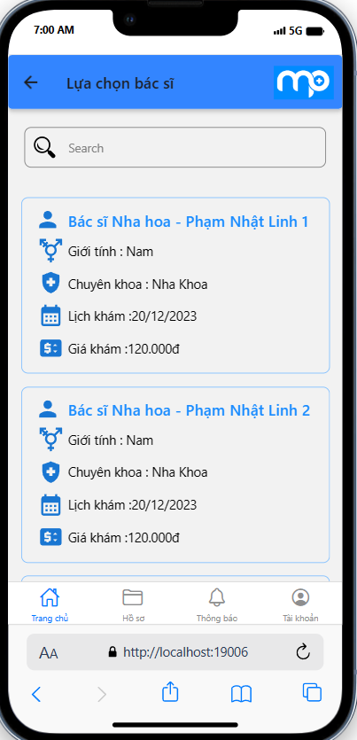
  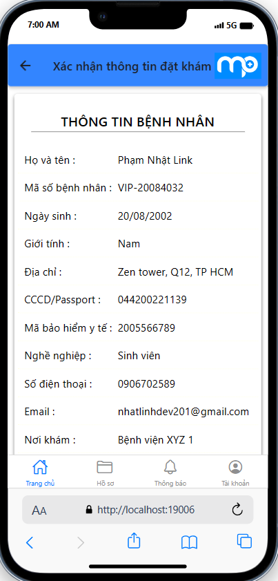
  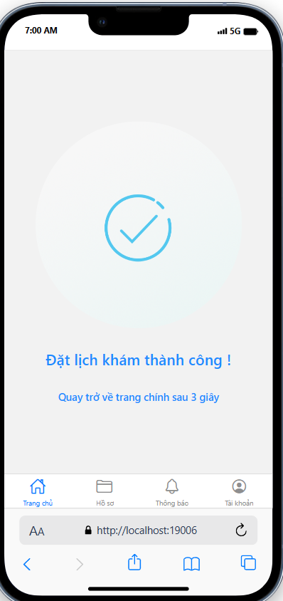
  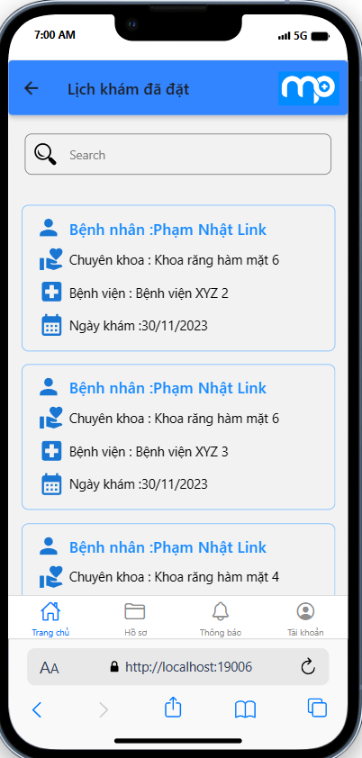
  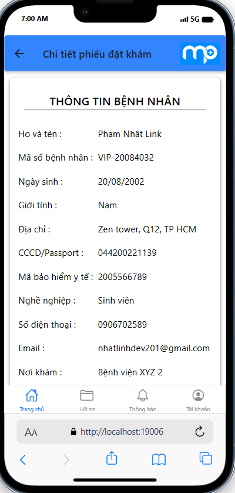

  
The interface design and flow with Figma. : [Figma design](https://www.figma.com/file/21qLRrr323UojS8J9Pc97d/MEDPRO---%C4%90%E1%BA%B7t-l%E1%BB%8Bch-kh%C3%A1m-b%E1%BB%87nh?type=design&node-id=0%3A1&mode=design&t=zdGoH4KtDCj521t9-1) 
